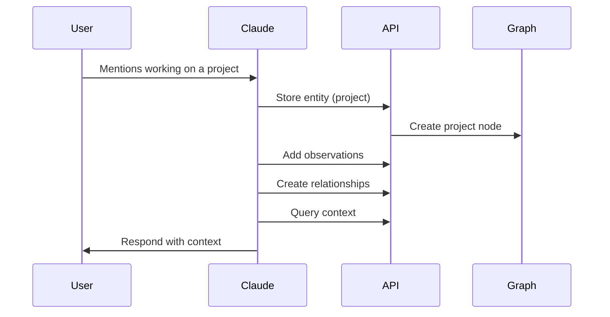

# Claude Brain - Architecture & Usage Guide

## Overview
Claude Brain is a knowledge management system designed to give Claude and other AI assistants persistent memory and context awareness through a graph-based data structure. It allows AI to store, retrieve, and relate information across conversations and sessions.

## Core Components

### 1. Knowledge Graph
- **Entities**: Core nodes representing concepts, users, or objects
- **Relationships**: Connections between entities showing how they relate
- **Observations**: Factual data and insights about entities
- **Interactions**: Historical record of conversations and actions

### 2. REST API
The system is primarily accessed through a RESTful API secured with Laravel Sanctum:

#### Key Endpoints:
```
/api/v1/entities       # Manage knowledge nodes
/api/v1/observations   # Store and retrieve facts
/api/v1/relationships  # Manage connections
/api/v1/graph/*       # Graph operations and traversal
```

### 3. Authentication
- Token-based authentication using Sanctum
- Each AI instance gets its own API token
- Rate limiting and access control built-in

## Usage Patterns

### 1. During Conversations


### 2. Knowledge Building
Claude can:
- Store new entities as they're discovered
- Create relationships between concepts
- Add observations with confidence levels
- Update existing knowledge
- Query for related information

### 3. Context Management
```text
User Context
├── Preferences
├── Technical Knowledge
├── Recent Interactions
└── Project History

Conversation Context
├── Current Topic
├── Related Concepts
└── Previous References
```

## Common Use Cases

### 1. User Profiling
```json
{
  "entity": {
    "type": "user",
    "name": "john_doe",
    "observations": [
      {
        "content": "Experienced with Python",
        "confidence": 0.9,
        "source": "conversation"
      }
    ]
  }
}
```

### 2. Project Tracking
```json
{
  "entity": {
    "type": "project",
    "name": "API Migration",
    "relationships": [
      {
        "type": "owns",
        "target": "user:john_doe"
      }
    ]
  }
}
```

### 3. Knowledge Association
```json
{
  "relationships": [
    {
      "from": "concept:machine_learning",
      "to": "concept:python",
      "type": "requires",
      "metadata": {
        "strength": 0.8
      }
    }
  ]
}
```

## Integration Guidelines

### 1. For AI Assistants
```python
# Example Python integration
async def store_observation(entity_id, content, confidence):
    await api.post('/v1/observations', {
        'entity_id': entity_id,
        'content': content,
        'confidence': confidence
    })

async def get_user_context(user_id):
    return await api.get(f'/v1/graph/traverse', {
        'start': user_id,
        'depth': 2,
        'types': ['preference', 'skill', 'project']
    })
```

### 2. Error Handling
- Handle API rate limits gracefully
- Implement retry logic for failed requests
- Cache frequently accessed data
- Validate data before storage

### 3. Best Practices
- Store information with confidence levels
- Use consistent entity typing
- Create meaningful relationships
- Clean up outdated information
- Validate incoming data

## Performance Considerations

### 1. Caching Strategy
```php
// Example caching implementation
Cache::remember("entity:{$id}", 3600, function() {
    return Entity::with('observations')
                 ->with('relationships')
                 ->find($id);
});
```

### 2. Query Optimization
- Use eager loading for relationships
- Implement pagination for large result sets
- Use indexed fields for common queries
- Cache frequent traversal patterns

## Security Guidelines

### 1. Authentication
- Use HTTPS for all API calls
- Implement token rotation
- Set appropriate token expiry
- Monitor for unusual patterns

### 2. Data Privacy
- Implement data retention policies
- Allow for data erasure requests
- Encrypt sensitive metadata
- Log access patterns

## Scaling Considerations

### 1. Database
- Partition data by AI instance
- Index frequently queried paths
- Implement query caching
- Consider graph database for large scales

### 2. API
- Implement request queuing
- Use horizontal scaling
- Cache heavy computations
- Optimize common queries

## Future Enhancements

### 1. Planned Features
- Real-time updates via WebSockets
- Advanced graph traversal algorithms
- Machine learning for confidence scoring
- Automated knowledge cleanup
- Cross-instance knowledge sharing

### 2. Integration Options
- Direct database access for high-performance needs
- Batch processing for bulk operations
- Event-driven updates
- Custom query endpoints

## Monitoring and Maintenance

### 1. Health Checks
- API endpoint monitoring
- Graph consistency validation
- Performance metrics tracking
- Error rate monitoring

### 2. Maintenance Tasks
- Regular data cleanup
- Index optimization
- Cache warming
- Token rotation