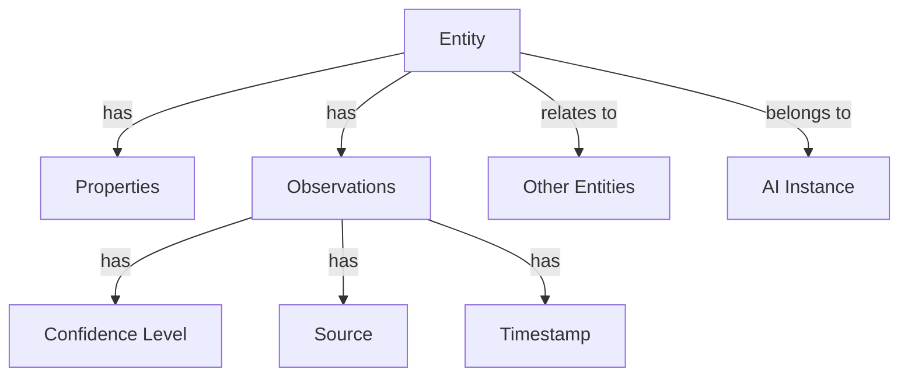

# AI Memory System - Architecture & Usage Guide

## Overview
A generic, scalable system for providing persistent memory and context awareness to any AI system through a graph-based data structure. The system allows AI models to store, retrieve, and relate information across sessions while maintaining separation and security.

## Core Concepts

### 1. Multi-Tenant Design
```
Instance Separation
├── Instance A (e.g., Personal Assistant)
│   ├── Private Knowledge Graph
│   └── Instance-specific Settings
├── Instance B (e.g., Customer Service Bot)
│   ├── Private Knowledge Graph
│   └── Custom Configurations
└── Shared Knowledge (Optional)
    └── Common Knowledge Base
```

### 2. Knowledge Structure


## System Components

### 1. Core API
- Instance Management
- Entity Operations
- Relationship Management
- Query & Traversal
- Memory Management

### 2. Storage Options
```yaml
Primary Storage:
  - PostgreSQL (Default)
  - Neo4j (Optional for large graphs)
  - MongoDB (Optional for specific cases)

Caching Layer:
  - Redis
  - Memcached
```

### 3. Security & Privacy
```php
// Instance isolation example
class InstanceScope extends Scope
{
    public function apply(Builder $builder, Model $model)
    {
        $builder->where('instance_id', Auth::instance()->id);
    }
}
```

## Integration Patterns

### 1. Direct API Integration
```python
# Generic AI client example
class AIMemoryClient:
    def __init__(self, instance_id, api_key):
        self.instance_id = instance_id
        self.api_key = api_key

    async def store_memory(self, content, type, metadata=None):
        return await self.post('/memories', {
            'content': content,
            'type': type,
            'metadata': metadata
        })

    async def query_context(self, query, filters=None):
        return await self.get('/context', {
            'query': query,
            'filters': filters
        })
```

### 2. Event-Driven Integration
```javascript
// Event-based memory storage
memorySystem.on('interaction', async (event) => {
    await storeMemory({
        type: event.type,
        content: event.data,
        context: event.context,
        timestamp: Date.now()
    });
});
```

### 3. Batch Processing
```python
# Batch memory operations
async def process_memory_batch(memories):
    return await client.post('/memories/batch', {
        'memories': memories,
        'options': {
            'deduplication': True,
            'validation': True
        }
    })
```

## Use Cases

### 1. Personal AI Assistant
```json
{
  "instance_type": "personal_assistant",
  "features": {
    "user_preferences": true,
    "conversation_history": true,
    "task_tracking": true
  },
  "privacy_level": "strict"
}
```

### 2. Customer Service Bot
```json
{
  "instance_type": "customer_service",
  "features": {
    "knowledge_base": true,
    "interaction_history": true,
    "response_templates": true
  },
  "privacy_level": "moderate"
}
```

### 3. Research Assistant
```json
{
  "instance_type": "research_assistant",
  "features": {
    "citation_tracking": true,
    "methodology_memory": true,
    "data_analysis_history": true
  },
  "privacy_level": "configurable"
}
```

## Memory Management

### 1. Storage Policies
```yaml
Retention Rules:
  - Time-based expiry
  - Confidence-based pruning
  - Usage-based retention
  - Priority-based storage

Privacy Controls:
  - Data anonymization
  - Access restrictions
  - Deletion policies
```

### 2. Memory Optimization
```python
class MemoryOptimizer:
    def consolidate_memories(self):
        # Merge similar memories
        # Update confidence levels
        # Remove redundancies
        pass

    def prioritize_memories(self):
        # Score by recency
        # Score by usage
        # Score by relevance
        pass
```

### 3. Context Management
```python
class ContextManager:
    def get_relevant_context(self, query, scope):
        # Search memory graph
        # Apply relevance scoring
        # Filter by scope
        # Return formatted context
        pass
```

## Scalability Features

### 1. Horizontal Scaling
```yaml
Components:
  - API Servers
  - Background Workers
  - Cache Nodes
  - Database Clusters

Load Balancing:
  - Request Distribution
  - Instance Separation
  - Resource Allocation
```

### 2. Performance Optimization
```python
# Caching strategy
cache_config = {
    'frequently_accessed': {
        'ttl': 3600,
        'strategy': 'LRU'
    },
    'computation_heavy': {
        'ttl': 1800,
        'strategy': 'LFU'
    }
}
```

### 3. Resource Management
```python
class ResourceManager:
    def allocate_resources(self, instance_type):
        # Determine resource needs
        # Allocate appropriate capacity
        # Monitor usage
        # Scale as needed
        pass
```

## Implementation Guidelines

### 1. Instance Setup
```bash
# Create new AI instance
php artisan ai:instance:create \
  --name="Research Assistant" \
  --type="research" \
  --features="citations,methodology" \
  --privacy-level="high"
```

### 2. Memory Integration
```php
// Memory storage middleware
class MemoryStorageMiddleware
{
    public function handle($request, $next)
    {
        // Process incoming request
        $response = $next($request);
        
        // Store relevant memories
        dispatch(new StoreMemoryJob([
            'content' => $request->input(),
            'response' => $response->getContent(),
            'context' => $this->getRequestContext()
        ]));
        
        return $response;
    }
}
```

### 3. Query Optimization
```sql
-- Example index creation for common queries
CREATE INDEX idx_memories_instance_type 
ON memories (instance_id, memory_type);

CREATE INDEX idx_memories_confidence 
ON memories (confidence_score DESC);
```

## Future Considerations

### 1. Planned Features
- Cross-instance learning (opt-in)
- Advanced memory consolidation
- Automated relevance scoring
- Real-time memory updates
- Custom storage adapters

### 2. Integration Expansion
- WebSocket support
- GraphQL API
- Streaming updates
- Bulk operations
- Custom plugins

### 3. Advanced Features
- Memory chains
- Contextual learning
- Pattern recognition
- Automated cleanup
- Version control